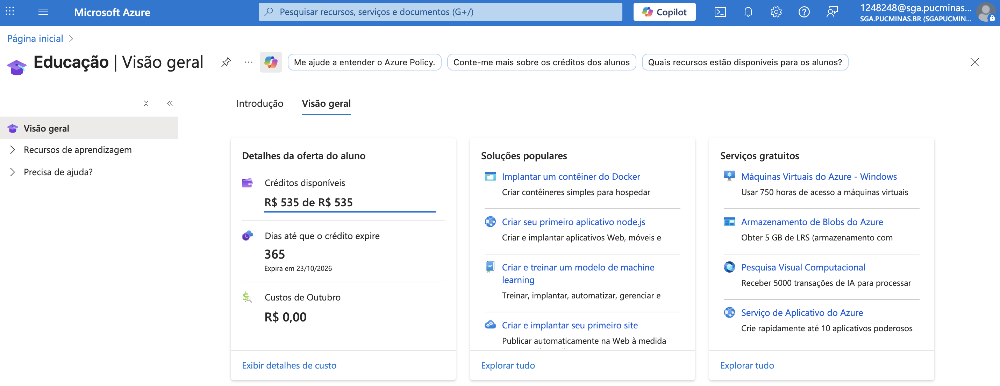
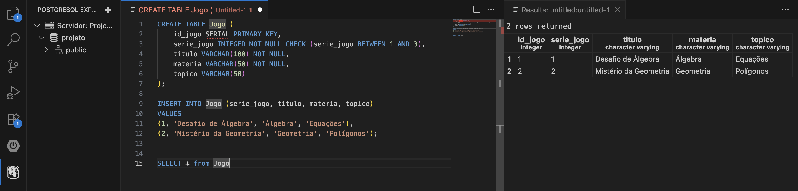
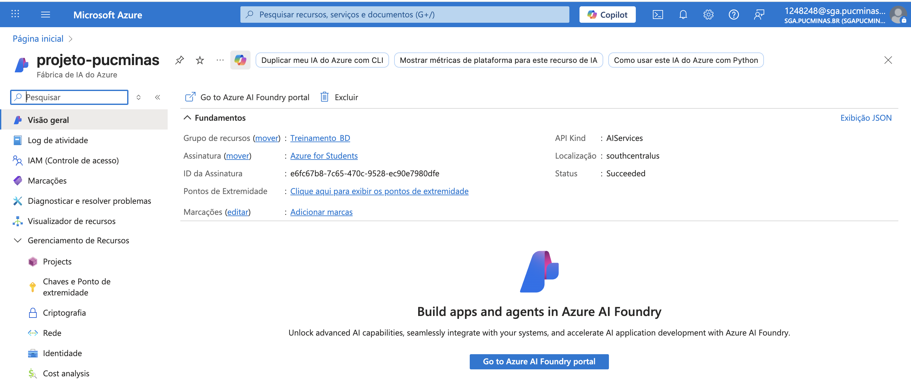

# 🧠 Exercício 4 — Computação em Nuvem e Inteligência Artificial (Azure)

---

## ✅ Imagem da tela do Portal Azure, mostrando o usuário vinculado à conta acadêmica

---

## 🗄️ Banco de Dados PostgreSQL no Azure

### ✅ Imagem 1: Detalhes do recurso criado no Azure

### ✅ Imagem 2: Conexão ativa ao banco PostgreSQL e resultado do SELECT

---

## 🤖 Inteligência Artificial (Azure Cognitive Services)

### ✅ Imagem 1: Recurso do Azure AI Language criado

